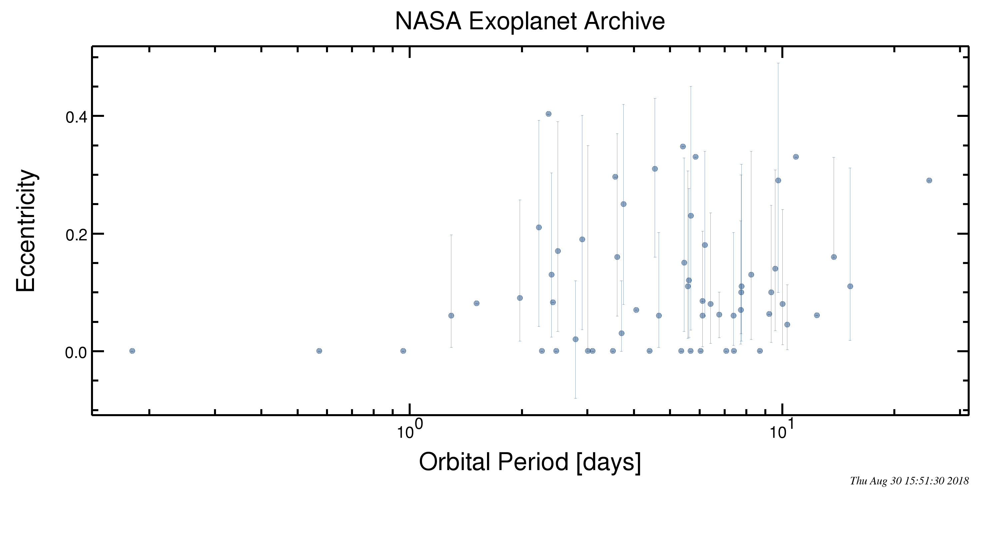
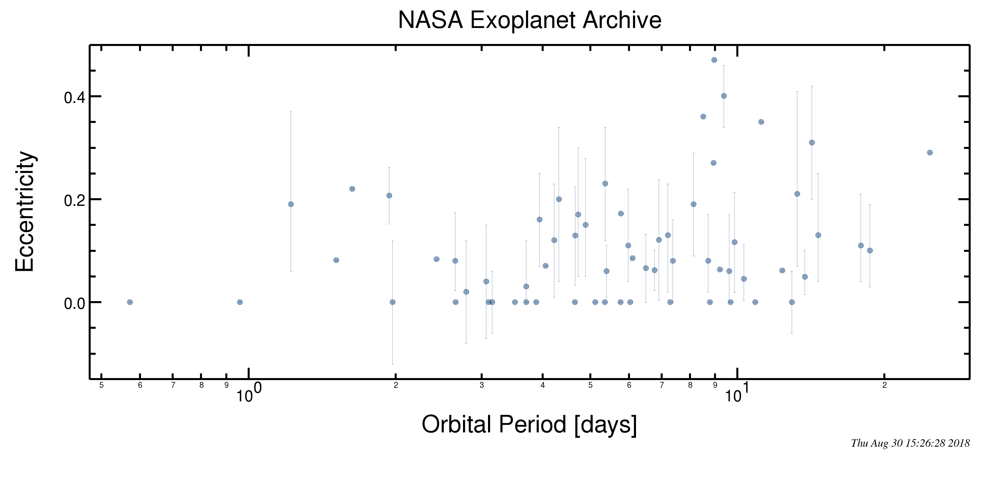

==================================================================
Small Planet Characterization Through Tidal Dissipation Efficiency
==================================================================

Potentially Relevant Articles:
------------------------------

  * `CKS VIII: Eccentricities of Kepler Planets and Tentative Evidence of a High Metallicity Preference for Small Eccentric Planets <https://ui.adsabs.harvard.edu/abs/2019arXiv190504625M/abstract>`_

Proposed approach:
------------------

In the solar system, rocky bodies (Mercury, Venus, Earth, Mars, Iapetus, Triton)
all have small tidal Q' values: Q' <= few hundred; while giant planets (Jupiter,
Saturn, and Uranus) have much higher values Q' >= 10^5 (`Goldreich and Soter
1966 <https://websites.pmc.ucsc.edu/~pkoch/EART_206/09-0127/Goldreich%20&%20Soter%2066%20Icarus%205-375.pdf>`_
). This suggests that planets in the super-earth range can be classified on the
basis of their Q' values if those can be inferred.

Tantalizingly, the orbital eccentricities of Kepler super-earths seem to follow
the expected tidal circularization pattern:

    The eccentricity vs. period for planets with radii < 3 Earth radii and
    semimajor axis less than 0.1 AU.

Of these planets: 19 have measured masses, and 40 do not. The 19 can serve as a
validation set. Further, RV planets can also be used for validation:

    The eccentricity vs. period for planets with mass less than 10 Earth masses,
    and semimajor axis less than 0.1 AU.

However, most of these planets are in multi-planet systems, thus deriving
reliable Q' constraints requires combining tidal evolution with mutual
interactions.

Caveats:
  * Many of the validation planets are RV planets, hence their radius is unknown and mass
    is only lower limit (36 planets from transits + 47 from RV + 2 from orbital
    brightness modulations, 39 have known radii and exact masses).
  * Eccentricities are subject to large uncertainties, most of them consistent
    with zero.
  * Mutual orientation of the orbits is unknown, though multi planet systems
    tend to be aligned.
